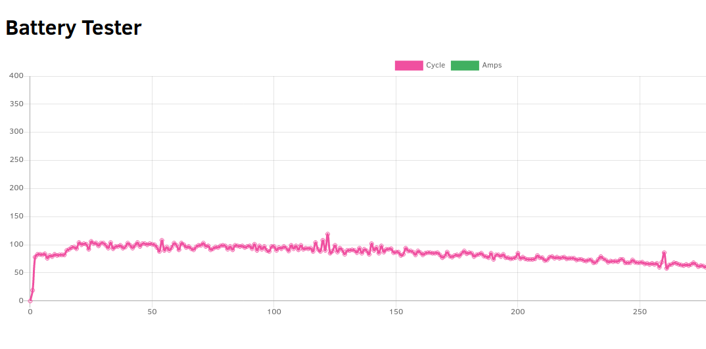

# battery-test
Program to make a battery cycling test used together with Arduino circuit. 
I use server-side to read serial port of Arduino and send to front-end to plot graphics and specifications.

https://github.com/danrosselli/batterytest/blob/master/graph1.png
